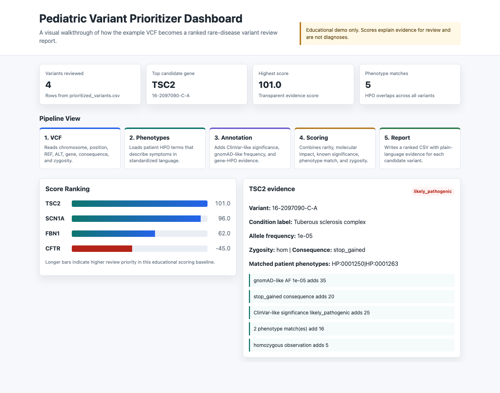

# Pediatric Variant Prioritizer

An educational clinical-genomics pipeline that prioritizes rare-disease candidate
variants from a patient VCF, phenotype terms, and lightweight annotation tables.



## Why This Matters

Clinical sequencing can return many genetic variants for one patient. Most are
benign or unrelated to the patient's symptoms. This project demonstrates how a
bioinformatics workflow can combine variant-level evidence, population
frequency, clinical significance, and phenotype matching to rank variants for
review.

The current version uses transparent evidence scoring rather than a trained ML
model. That makes the reasoning inspectable and creates a clean baseline for a
future supervised variant-ranking model.

## What It Does

- Parses a small VCF file containing candidate variants.
- Loads patient phenotype terms encoded as HPO IDs.
- Joins ClinVar-style, gnomAD-style, and gene-phenotype reference annotations.
- Scores variants using rarity, predicted molecular consequence, clinical
  significance, HPO overlap, and zygosity.
- Generates a ranked CSV report with plain-language evidence.
- Builds a self-contained HTML dashboard for visual review.

## Dashboard

The dashboard in `dashboard/index.html` shows:

- summary metrics for the ranked variant set
- the pipeline flow from VCF to report
- score bars by candidate gene
- a clickable ranked variant table
- evidence details for each selected variant

Build or rebuild it after generating `results/prioritized_variants.csv`:

```bash
python3 scripts/build_dashboard.py
```

Then open `dashboard/index.html` in a browser.

## Quick Start

Run the example prioritization workflow:

```bash
PYTHONPATH=src python3 -m pediatric_variant_prioritizer.cli \
  --vcf data/example/patient.vcf \
  --hpo data/example/patient_hpo.txt \
  --reference-dir data/reference \
  --output results/prioritized_variants.csv
```

Run tests:

```bash
PYTHONPATH=src python3 -m unittest
```

If you are new to genomics, start with:

- `docs/beginner_guide.md`

## Example Output

The synthetic demo ranks `TSC2` first because it combines several high-priority
signals:

- very rare gnomAD-style allele frequency
- high-impact `stop_gained` consequence
- `likely_pathogenic` clinical significance
- two HPO phenotype matches
- homozygous zygosity in the simplified example data

The generated report is written to:

```text
results/prioritized_variants.csv
```

Generated result files are intentionally ignored by git so the workflow can be
rerun without committing local outputs.

## Technical Highlights

- Python package layout under `src/`
- standard-library VCF parsing for the demo format
- dataclass-based domain models
- CSV annotation joins
- transparent evidence-based scoring
- reproducible CLI workflow
- self-contained HTML/CSS/JavaScript dashboard
- unit tests with `unittest`

## Project Structure

```text
src/pediatric_variant_prioritizer/
  annotation.py   Load reference tables and annotate variants
  cli.py          Command-line interface
  models.py       Shared dataclasses
  report.py       CSV report writer
  scoring.py      Transparent evidence-based ranking
  vcf.py          Minimal VCF parser

data/example/     Synthetic patient VCF and HPO terms
data/reference/   Miniature ClinVar/gnomAD/HPO-style annotation tables
dashboard/        Self-contained visual dashboard
docs/             Beginner guide and README assets
scripts/          Dashboard generator
tests/            Unit tests
```

## Roadmap

- Export an ML-ready feature table from the scoring pipeline.
- Train a baseline classifier or ranker on labeled synthetic or public-derived
  examples.
- Add support for VEP or SnpEff annotated VCFs.
- Expand the reference annotation layer with public data sources.
- Add GitHub Actions for automated tests.
- Replace the miniature demo data with a more realistic public or synthetic VCF
  workflow.

## Disclaimer

This project is for education and portfolio demonstration only. It is not a
medical device, not validated clinical decision support, and not suitable for
diagnosis or patient care.
